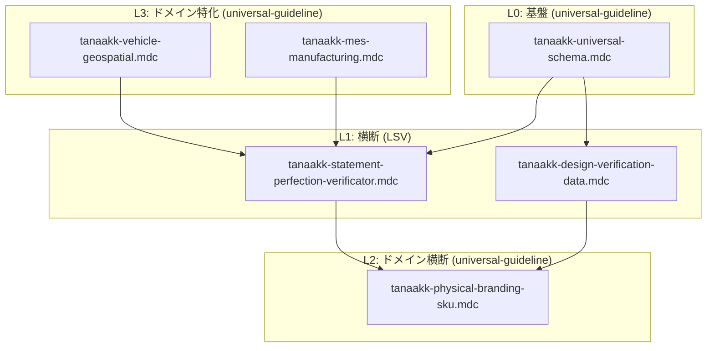

# Law of Scale Verificator 階層・universal-guideline との関係

## 1. 位置づけ

Law of Scale Verificator (LSV) は **L1 横断ルール** として universal-guideline と併用する。

## 2. 適用順序

1. **L0**: `tanaakk-universal-schema.mdc` — UUID v4、時刻、通貨、禁止事項
2. **L1**: `tanaakk-statement-perfection-verificator.mdc` — 10カテゴリー、認証キー、Verification プロセス
3. **L1**: `tanaakk-design-verification-data.mdc` — デザインメタデータスキーマ
4. **L2/L3**: ドメイン別ルール（カラー・SKU、車両・建設・製造）

## 3. 参照マトリクス

| | universal-schema | statement-perfection | design-verification-data | physical-branding-sku | vehicle-geospatial |
|---|------------------|---------------------|--------------------------|----------------------|-------------------|
| **universal-schema** | - | - | - | - | - |
| **statement-perfection** | ✓ 併用 | - | - | - | - |
| **design-verification-data** | ✓ 併用 | ✓ 併用 | - | - | - |
| **physical-branding-sku** | ✓ ベース | - | - | - | - |
| **vehicle-geospatial** | ✓ ベース | 建築時参照 | - | - | - |
